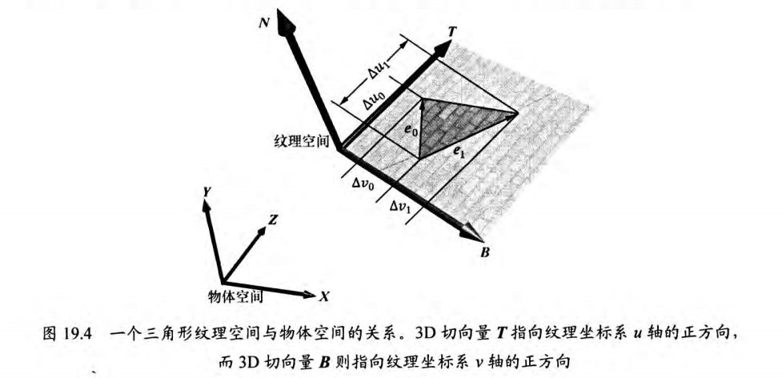

# Note

## normal mapping

法线贴图本质上是一种纹理，其中每一个纹素(RGB)存储的是压缩后的x、y、z坐标，即一个法向量。其中Alpha通道可以保留不用，也可以用于存储地形的高度图或者高光图等标量信息。

因为法线贴图中的向量大部分都近似平行于z轴，所以这些向量的的z值是三种坐标分量的最大值，所以当法线贴图看作彩色图像时，整体会呈现蓝色。

因为法线是单位向量，所以坐标范围是 $[-1,1]$ ，我们可以使用如下函数将其压缩到 $[0,255]$：

$$
f(x)=\frac{x+1}{2}\times 255
$$

然后使用其反函数进行解压：

$$
f^{-1}(x)=\frac{2x}{255}-1
$$

### tangent space

假设在纹理贴图的过程种不存在纹理扭曲形变的现象，我们可以把纹理看作一张贴纸，其通过拾取、平移，以及旋转等方式，将它贴在3D三角形上。所以纹理坐标系的坐标轴与三角形相切，并于三角形处于同一平面，结合三角形平面法线 $\boldsymbol{N}$ ，我们就得到了纹理坐标系的一组基，即 $TBN$ 基，其中 $\boldsymbol{T}$ 、 $\boldsymbol{B}$ 、 $\boldsymbol{N}$ 分别为切线(tangent)、副切线(bitangent)和法线(normal)，该基所在的坐标系被称为切线空间/纹理空间。此外切线空间通常会随不同的三角形而变化。

因为计算光照需要法向量和光源在同一空间内，所以我们需要将法向量从切线空间转换到世界空间。首先设纹理坐标分别为 $(u_0,v_0)$、$(u_1,v_1)$、$(u_2,v_2)$ ，其对应的顶点 $\boldsymbol{v_0}$ 、 $\boldsymbol{v_1}$ 、 $\boldsymbol{v_2}$ 在相对于纹理坐标系坐标轴(即 $\boldsymbol{T}$ 和 $\boldsymbol{B}$ )构成的平面内定义了一个三角形，设 $\boldsymbol{e_0}=\boldsymbol{v_1}-\boldsymbol{v_0}$ 、 $\boldsymbol{e_1}=\boldsymbol{v_2}-\boldsymbol{v_0}$ 为三角形的两条边向量，它们对应的纹理三角形的边向量分别为：$(\Delta u_0,\Delta v_0)=(u_1-u_0,v_1-v_0)$ 和 $(\Delta u_1,\Delta v_1)=(u_2-u_0,v_2-v_0)$，如下图所示。

所以我们可以得到如下方程组：

$$
\begin{aligned}
\boldsymbol{e_0}&=\Delta u_0\boldsymbol{T}+\Delta v_0\boldsymbol{B}\\
\boldsymbol{e_1}&=\Delta u_1\boldsymbol{T}+\Delta v_1\boldsymbol{B}
\end{aligned}
$$

进而得出如下矩阵方程：

$$
\begin{bmatrix} e_{0,x} & e_{1,x}  \\ e_{0,y} & e_{1,y}  \\ e_{0,z} & e_{1,z}  \\\end{bmatrix}
=\begin{bmatrix} T_{x} & B_{x}  \\ T_{y} & B_{y}  \\ T_{z} & B_{z}  \\\end{bmatrix}\begin{bmatrix} \Delta u_0 & \Delta u_1 \\ \Delta v_0 & \Delta v_1 \\\end{bmatrix}
$$

因为已经直到三角形的物体空间坐标，所以可以求出边向量的物体空间坐标，所以我们就可以求出 $\boldsymbol{T}$ 和 $\boldsymbol{B}$ 的物体空间坐标，即：

$$
\begin{bmatrix} T_{x} & B_{x}  \\ T_{y} & B_{y}  \\ T_{z} & B_{z}  \\\end{bmatrix}=\begin{bmatrix} e_{0,x} & e_{1,x}  \\ e_{0,y} & e_{1,y}  \\ e_{0,z} & e_{1,z}  \\\end{bmatrix}
\begin{bmatrix} \Delta u_0 & \Delta u_1 \\ \Delta v_0 & \Delta v_1 \\\end{bmatrix}^{-1}
$$

要注意， $\boldsymbol{T}$ 和 $\boldsymbol{B}$ 的物体空间坐标并不是单位向量，且如果纹理发生了扭曲形变，这两个向量也不一定正交。

在实际应用时，需要计算共用顶点v的每个三角形的切向量平均值(没有切向量则使用上述方式计算出 $\boldsymbol{T}$ 和 $\boldsymbol{B}$ )，同理法线也需要计算平均值，一般选择规范法向量作为第一个基向量，然后使用施密特正交化规范切向量，最后通过叉乘计算副切线。

### 切线空间和物体空间的转换

现在我们已经确定了每个顶点处的正交规范化 $TBN$ 基，所以我们可以通过如下矩阵将切线空间的向量转换到物体空间：

$$
\boldsymbol{M}_{object}=\begin{bmatrix} T_x & B_x & N_x \\ T_y & B_y & N_y \\ T_z & B_z & N_z \\\end{bmatrix}
$$

因为该矩阵是正交矩阵，所以其逆矩阵就是其转置矩阵，所以将向量从物体空间转换到切线空间的矩阵为：

$$
\boldsymbol{M}_{tangent}=\begin{bmatrix} T_x & T_y & T_z \\ B_x & B_y & B_z \\ N_x & N_y & N_z \\\end{bmatrix}
$$

进一步将向量转换到世界空间只需要乘以模型(世界)矩阵即可。

$$
\boldsymbol{n}_{world}=\boldsymbol{M}_{world}\boldsymbol{M}_{object}\boldsymbol{n}_{tangent}
$$

因为我们只关心向量的变换，所以只需要使用 $3\times 3$ 矩阵来表示即可。