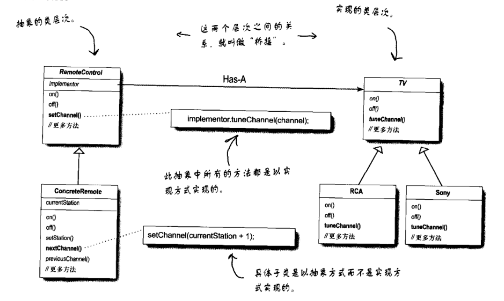

# 设计模式
[toc]

## 桥接模式

将抽象部分(业务功能)与实现部分(平台实现)分离，使它们都可以独立地变化。

一般来说，实现部分是抽象部分的某一属性(组件)的相关操作

桥接模式是多继承的一种替代方案，多继承往往违背单一职责原则，复用性较差，故选择桥接模式替代

## 工厂方法

定义一个用于创建对象的接口，让子类决定实例化哪一个类。Factory Method使得一个类的实例化延迟（目的：解耦，手段：虚函数）到子类。

## 抽象工厂

提供一个接口，让该接口负责创建一系列“相关或者相互依赖的对象”，无需指定它们具体的类。

